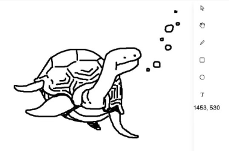

# clay



<br>

This crate aims to provide a interactive design tool as a functional Yew component. Currently, `clay` can move around and freehand, draw rectangles or circles on an infinite canvas.

`clay` heavily relies on wasm32 SIMD intrinsics. Since this problem space is bound to planar and spatial operations, this crate also aims to implement every geometric operation in SIMD.

There isn't a clear roadmap ahead but most exciting ideas are persisting shapes to disk and simple multicollaboration.

## How to Run
> *These instructions make use of `just`. To install, simply `cargo install just`*
>
> [Install prerequisites](https://yew.rs/docs/getting-started/introduction)

To run the app:
```bash
just run    
```

To compile or test the `math` crate:
```bash
cd math && just build # or just test
```

## Performance
The effects of SIMD are not measured yet. An ad-hoc benchmark comparing `clay` and the original Typescript scalar implementation [written by Alikiki](https://github.com/alikiki/baby-tldraw) is planned. 

## Reading 
[Baby Tldraw](https://www.hajeon.xyz/posts/post-content/20240413_tldraw.html)

[Creating a Zoom UI](https://www.steveruiz.me/posts/zoom-ui)

> A canvas is a fixed 2-dimensional plane of infinite dimensions. All shapes and objects rendered on the canvas operate in 2-dimensional space. 
> 
> The camera is suspended above and points at the canvas. The camera operates in 3-dimensional space.
>
> The implementations for converting from screen to canvas and finding the viewport can be found in Steve Ruiz's blog post above.

[MDN's SVG Resource](https://developer.mozilla.org/en-US/docs/Web/SVG)